# Mermaid Flowchart Syntax Guide

## Basic Syntax

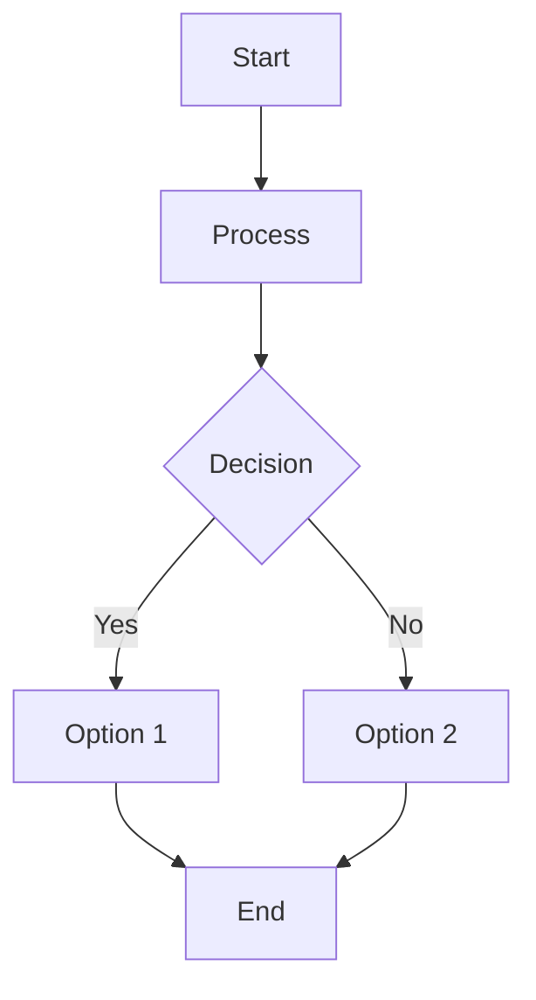

## Direction Options

- `TD` or `TB` - Top to bottom (default)
- `BT` - Bottom to top
- `LR` - Left to right
- `RL` - Right to left

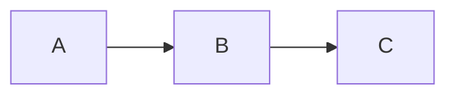

## Node Shapes

### Rectangle
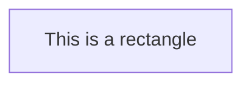

### Rounded Rectangle

### Stadium Shape
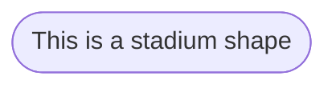

### Subroutine
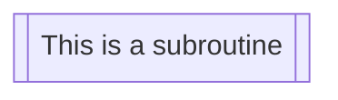

### Database
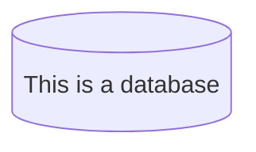

### Circle
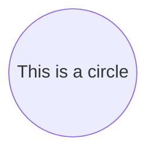

### Diamond (Decision)
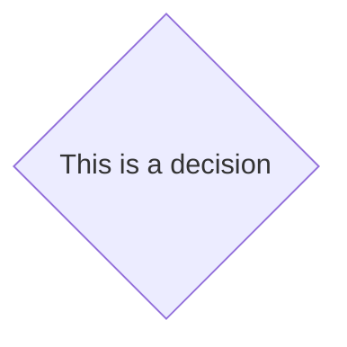

### Hexagon
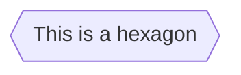

### Parallelogram
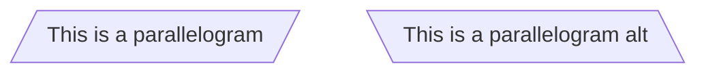

### Trapezoid
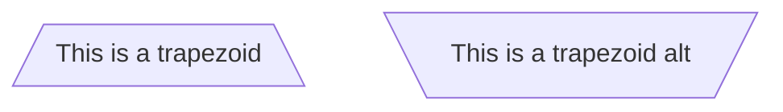

## Arrow Types

### Solid Arrow

### Dotted Arrow
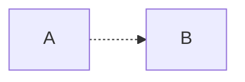

### Thick Arrow
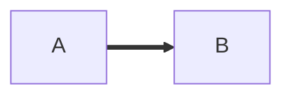

### Line Without Arrow
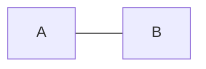

### Arrow with Text
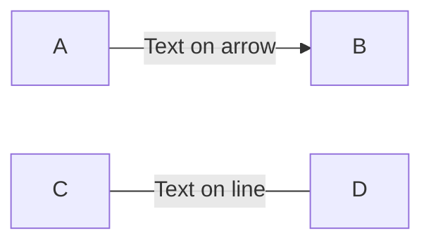

## Complete Example

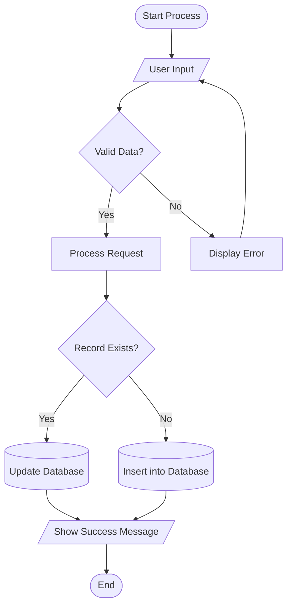

## Subgraphs

You can group nodes together:

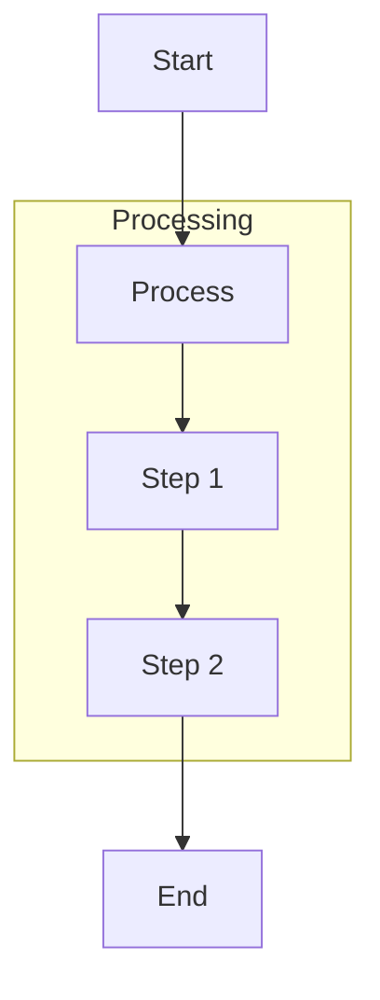

## Styling

Add custom styles to nodes:

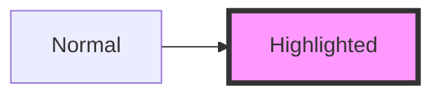

## Tips

- Use descriptive IDs (A, B, C or meaningful names)
- Keep diagrams simple and readable
- Use appropriate node shapes for different types of steps
- Add labels to decision branches for clarity
- Group related processes using subgraphs